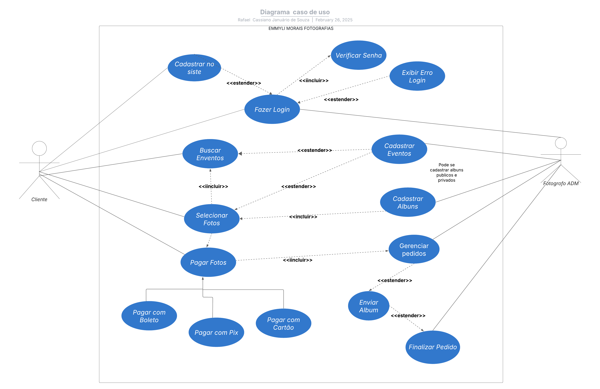

# Especificações do Projeto

A profissional da fotografia enfrenta desafios na gestão de seu trabalho devido ao uso de múltiplas plataformas que são caras, limitadas e não oferecem todas as funcionalidades necessárias. Para resolver esse problema, será desenvolvida uma plataforma digital personalizada que centraliza armazenamento, venda e entrega de fotos em um único ambiente. O sistema garantirá segurança, organização e acessibilidade, proporcionando uma experiência mais eficiente tanto para a fotógrafa quanto para seus clientes.

## Usuários
| Tipo de Usuário   | Descrição | Responsabilidades |
|------------------|-----------|------------------|
| **Administradora/Fotografa** | A fotógrafa é a administradora do sistema, responsável por gerenciar suas fotos, vendas e clientes, garantindo uma experiência eficiente e segura na plataforma. | Gerenciamento de Fotos (adicionar, organizar e configurar imagens para venda), Controle de Vendas (acompanhar pedidos, validar pagamentos e liberar downloads), Gestão de Clientes (visualizar histórico de compras e enviar notificações), Configuração do Sistema (personalizar identidade visual, definir preços e ajustar formas de pagamento).  |
| **Clientes** | Os clientes são usuários que acessam a plataforma para visualizar, comprar e baixar fotos. | xxxxx |


## Arquitetura e Tecnologias

Descreva brevemente a arquitetura definida para o projeto e as tecnologias a serem utilizadas. Sugere-se a criação de um diagrama de componentes da solução.

## Project Model Canvas

Deve ser desenvolvido a partir do microfundamento: Empreendedorismo e inovação.
Colocar a imagem do modelo construído apresentando a proposta de solução.

> **Links Úteis**:
> Disponíveis em material de apoio do projeto

## Requisitos

As tabelas que se seguem apresentam os requisitos funcionais e não funcionais que detalham o escopo do projeto. Para determinar a prioridade de requisitos, aplicar uma técnica de priorização de requisitos e detalhar como a técnica foi aplicada.


### Requisitos Funcionais

|ID    | Descrição do Requisito  | Prioridade |
|------|-----------------------------------------|----|
|RF-001| Login da fotógrafa – Controle de acesso para a fotógrafa. | ALTA | 
|RF-002| Sistema de cadastro, leitura, atualização e exclusão de clientes.   | ALTA |
|RF-003| Venda de fotos – Funcionalidade principal para monetização do site. | ALTA | 
|RF-004| Proteção contra impressões – Evite que as fotos sejam copiadas sem autorização. | ALTA | 
|RF-005| Permitir download de fotos editadas – Entrega final das imagens adquiridas. | ALTA | 
|RF-006| Sistema de pagamento integrado (PicPay, Pix) – Garantir que as transações sejam realizadas. | ALTA | 
|RF-007| Cadastrar fotos tiradas em eventos públicos e privados | ALTA |
|RF-008| Gerenciamento de pedidos – Gerar relatórios de vendas e de pagamentos. | ALTA | 
|RF-009| Permitir construção de galeria de fotos – Exposição do portfólio da fotógrafa para atrair novos clientes.| ALTA |
|RF-010| Upload de fotos - Ver, alterar e apagar| ALTA | 
|RF-011| Emitir notifacações automáticas para clientes e fotógrafos.| MÉDIA |  
|RF-012| Áreas de feedbacks – Permite ao cliente avaliar sobre o serviço e fotos. | BAIXA | 


### Requisitos não Funcionais

|ID     | Descrição do Requisito  |Prioridade |
|-------|-------------------------|----|
|RNF-001| Segurança – Proteção dos dados dos usuários e das fotos contra acessos não autorizados. | ALTA | 
|RNF-002| Desempenho – O site deve ser carregado rapidamente e ter alta disponibilidade.|  ALTA | 
|RNF-003| Escalabilidade – O sistema deve suportar um número crescente de usuários e fotos. |  ALTA | 
|RNF-004| Usabilidade – A interface deve ser intuitiva e fácil de navegar em qualquer dispositivo. |  ALTA | 
|RNF-005| Compatibilidade – O site deve ser acessível em navegadores modernos e responsivo para dispositivos móveis (iOS e Android). |  ALTA | 
|RNF-006| Confiabilidade – O sistema deve operar sem falhas críticas e garantir que os pagamentos sejam processados ​​corretamente. |  MÉDIA | 

Com base nas Histórias de Usuário, enumere os requisitos da sua solução. Classifique esses requisitos em dois grupos:


## Restrições

O projeto está restrito pelos itens apresentados na tabela a seguir.

|ID| Restrição                                             |
|--|-------------------------------------------------------|
|01| O projeto deverá ser entregue até o final do semestre |
|02| O projeto deve ser publicado no GitHub       |
|02| O sistema precisa ser compatível com navegadores mais utilizados (Google Chrome, Mozilla Firefox, Safari, Microsoft Edge)      |

## Diagrama de Caso de Uso



## Projeto da Base de Dados

O projeto da base de dados corresponde à representação das entidades e relacionamentos identificadas no Modelo ER, no formato de tabelas, com colunas e chaves primárias/estrangeiras necessárias para representar corretamente as restrições de integridade.

## Modelo ER 

O Modelo ER representa através de um diagrama como as entidades (coisas, objetos) se relacionam entre si na aplicação interativa.

As referências abaixo irão auxiliá-lo na geração do artefato “Modelo ER”.

> - 

## Esquema Relacional 

O Esquema Relacional corresponde à representação dos dados em tabelas juntamente com as restrições de integridade e chave primária.
 


## Modelo Físico
```
CREATE TABLE usuarios (
    id SERIAL PRIMARY KEY,
    nome VARCHAR(100) NOT NULL,
    email VARCHAR(150) UNIQUE NOT NULL,
    senha_hash TEXT NOT NULL,
    tipo ENUM('fotografo', 'cliente') NOT NULL,
    criado_em TIMESTAMP DEFAULT CURRENT_TIMESTAMP
);

CREATE TABLE eventos (
    id SERIAL PRIMARY KEY,
    fotografo_id INT NOT NULL,
    nome VARCHAR(255) NOT NULL,
    descricao TEXT,
    data_evento DATE NOT NULL,
    publico BOOLEAN DEFAULT FALSE,
    criado_em TIMESTAMP DEFAULT CURRENT_TIMESTAMP,
    FOREIGN KEY (fotografo_id) REFERENCES usuarios(id) ON DELETE CASCADE
);

CREATE TABLE fotos_evento (
    id SERIAL PRIMARY KEY,
    evento_id INT NOT NULL,
    url TEXT NOT NULL,
    tem_marca_agua BOOLEAN DEFAULT TRUE,
    criado_em TIMESTAMP DEFAULT CURRENT_TIMESTAMP,
    FOREIGN KEY (evento_id) REFERENCES eventos(id) ON DELETE CASCADE
);

CREATE TABLE albuns (
    id SERIAL PRIMARY KEY,
    usuario_id INT NOT NULL,
    nome VARCHAR(255) NOT NULL,
    criado_em TIMESTAMP DEFAULT CURRENT_TIMESTAMP,
    FOREIGN KEY (usuario_id) REFERENCES usuarios(id) ON DELETE CASCADE
);

CREATE TABLE album_fotos (
    album_id INT NOT NULL,
    foto_id INT NOT NULL,
    PRIMARY KEY (album_id, foto_id),
    FOREIGN KEY (album_id) REFERENCES albuns(id) ON DELETE CASCADE,
    FOREIGN KEY (foto_id) REFERENCES fotos_evento(id) ON DELETE CASCADE
);

CREATE TABLE itens (
    id SERIAL PRIMARY KEY,
    nome VARCHAR(255) NOT NULL,
    descricao TEXT,
    preco DECIMAL(10,2) NOT NULL,
    criado_em TIMESTAMP DEFAULT CURRENT_TIMESTAMP
);

CREATE TABLE compras (
    id SERIAL PRIMARY KEY,
    usuario_id INT NOT NULL,
    total DECIMAL(10,2) NOT NULL,
    status ENUM('pendente', 'pago', 'cancelado') DEFAULT 'pendente',
    criado_em TIMESTAMP DEFAULT CURRENT_TIMESTAMP,
    FOREIGN KEY (usuario_id) REFERENCES usuarios(id) ON DELETE CASCADE
);

CREATE TABLE itens_compra (
    compra_id INT NOT NULL,
    item_id INT NOT NULL,
    quantidade INT NOT NULL,
    preco DECIMAL(10,2) NOT NULL,
    PRIMARY KEY (compra_id, item_id),
    FOREIGN KEY (compra_id) REFERENCES compras(id) ON DELETE CASCADE,
    FOREIGN KEY (item_id) REFERENCES itens(id) ON DELETE CASCADE
);

CREATE TABLE pagamentos (
    id SERIAL PRIMARY KEY,
    compra_id INT NOT NULL,
    metodo ENUM('pix', 'picpay') NOT NULL,
    status ENUM('pendente', 'confirmado', 'falha') DEFAULT 'pendente',
    criado_em TIMESTAMP DEFAULT CURRENT_TIMESTAMP,
    FOREIGN KEY (compra_id) REFERENCES compras(id) ON DELETE CASCADE
);

CREATE TABLE notificacoes (
    id SERIAL PRIMARY KEY,
    usuario_id INT NOT NULL,
    mensagem TEXT NOT NULL,
    lida BOOLEAN DEFAULT FALSE,
    criado_em TIMESTAMP DEFAULT CURRENT_TIMESTAMP,
    FOREIGN KEY (usuario_id) REFERENCES usuarios(id) ON DELETE CASCADE
);

CREATE TABLE feedbacks (
    id SERIAL PRIMARY KEY,
    usuario_id INT NOT NULL,
    fotografo_id INT NOT NULL,
    avaliacao INT CHECK (avaliacao BETWEEN 1 AND 5),
    comentario TEXT,
    criado_em TIMESTAMP DEFAULT CURRENT_TIMESTAMP,
    FOREIGN KEY (usuario_id) REFERENCES usuarios(id) ON DELETE CASCADE,
    FOREIGN KEY (fotografo_id) REFERENCES usuarios(id) ON DELETE CASCADE
);

CREATE TABLE backup (
    id SERIAL PRIMARY KEY,
    usuario_id INT NOT NULL,
    url_backup TEXT NOT NULL,
    criado_em TIMESTAMP DEFAULT CURRENT_TIMESTAMP,
    FOREIGN KEY (usuario_id) REFERENCES usuarios(id) ON DELETE CASCADE
);
```
## Tecnologias Utilizadas

**HTML:** Linguagem de marcação usada para estruturar o conteúdo de páginas da web.

**CSS:** Linguagem de estilo usada para definir a aparência visual de elementos HTML, como cores, fontes e layout.

**C#**: Linguagem de programação usada para escrever a lógica do lado do servidor, geralmente em conjunto com o .NET.

**.NET:** Framework da Microsoft usado para construir aplicações de software, incluindo APIs e aplicações web no lado do servidor.

**SQL Server:** Sistema de gerenciamento de banco de dados relacional da Microsoft usado para armazenar e gerenciar dados estruturados.
