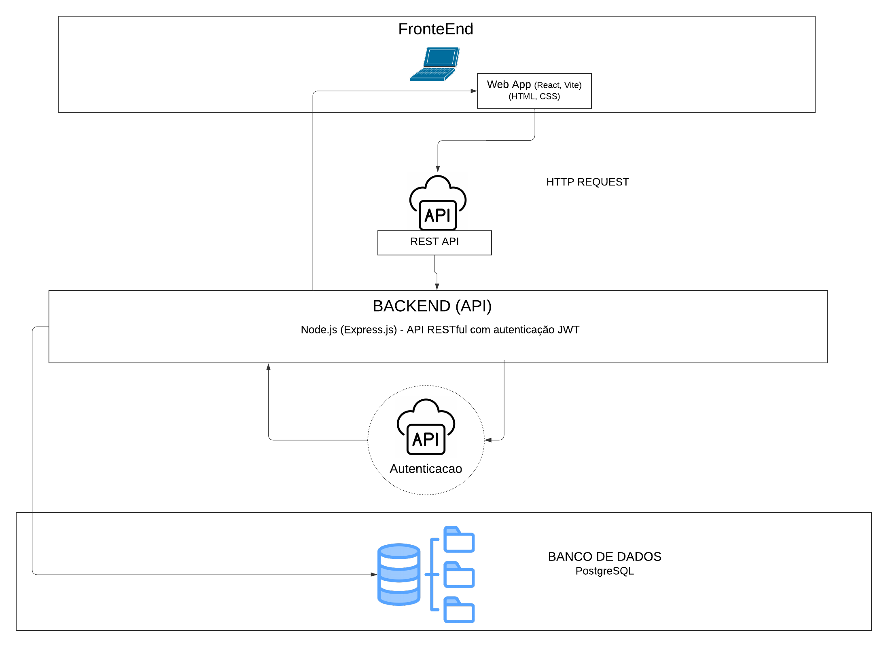
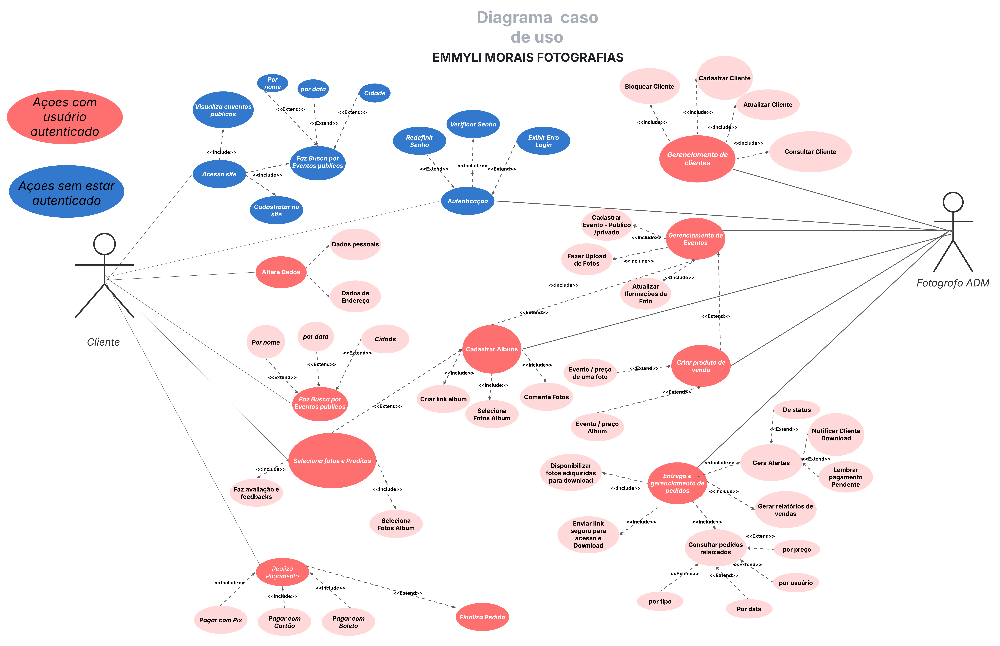
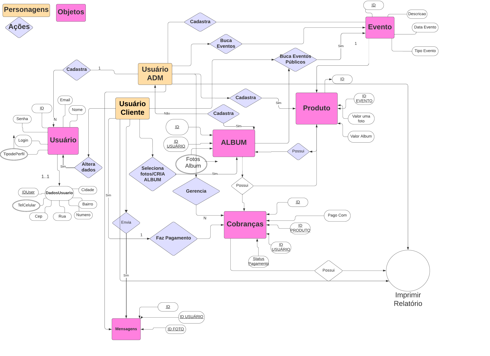
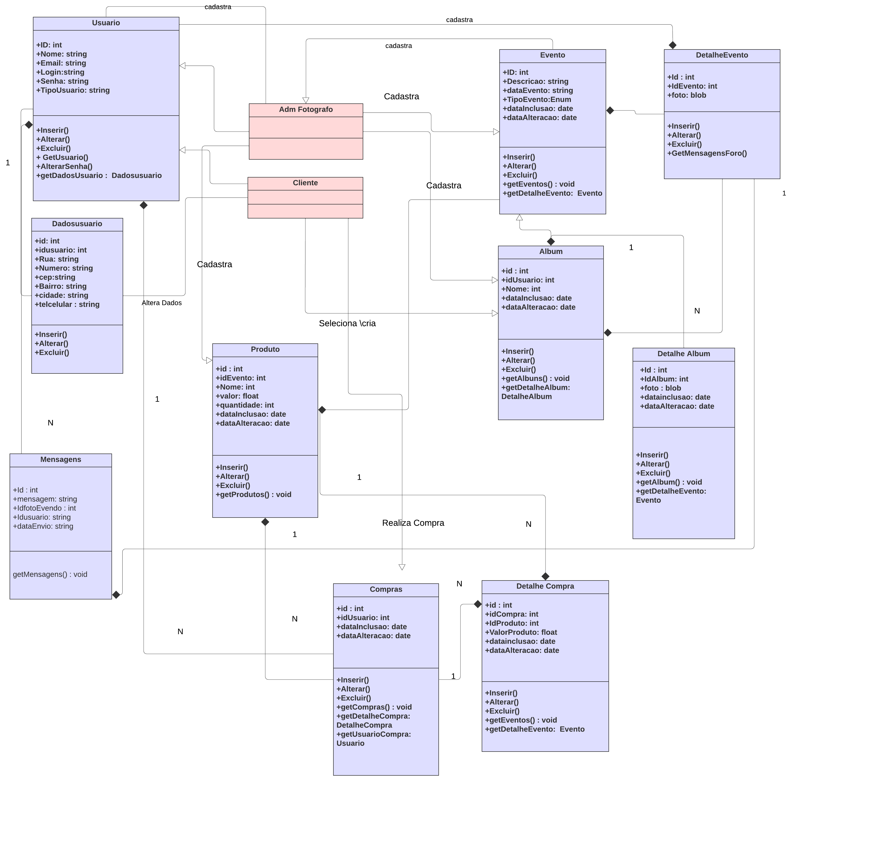
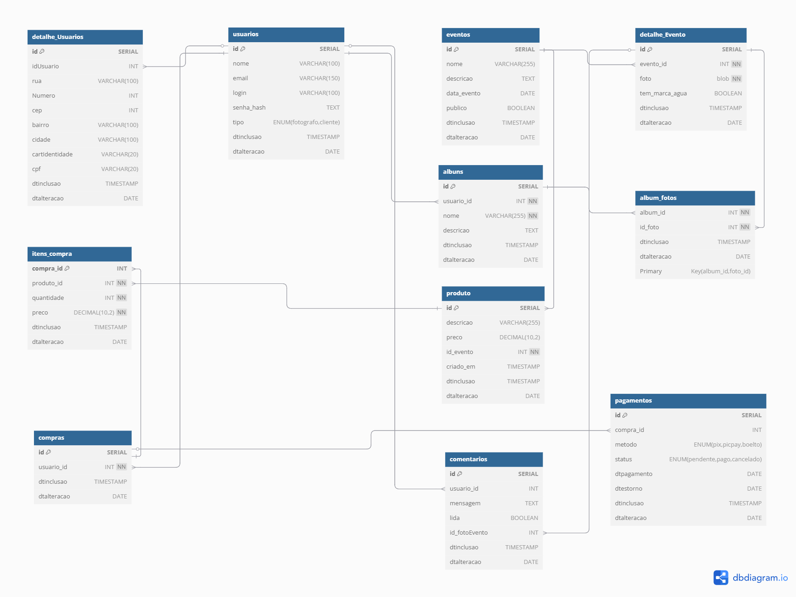

# Especificações do Projeto

A profissional da fotografia enfrenta desafios na gestão de seu trabalho devido ao uso de múltiplas plataformas que são caras, limitadas e não oferecem todas as funcionalidades necessárias. Para resolver esse problema, será desenvolvida uma plataforma digital personalizada que centraliza armazenamento, venda e entrega de fotos em um único ambiente. O sistema garantirá segurança, organização e acessibilidade, proporcionando uma experiência mais eficiente tanto para a fotógrafa quanto para seus clientes.

## Usuários
| Tipo de Usuário   | Descrição | Responsabilidades |
|------------------|-----------|------------------|
| **Administradora/Fotografa** | A fotógrafa é a administradora do sistema, responsável por gerenciar suas fotos, vendas e clientes, garantindo uma experiência eficiente e segura na plataforma. | Gerenciamento de Fotos (adicionar, organizar e configurar imagens para venda), Controle de Vendas (acompanhar pedidos, validar pagamentos e liberar downloads), Gestão de Clientes (visualizar histórico de compras e enviar notificações), Configuração do Sistema (personalizar identidade visual, definir preços e ajustar formas de pagamento).  |
| **Clientes** | Os clientes são usuários que acessam a plataforma para visualizar, comprar e baixar fotos. | xxxxx |


## Arquitetura e Tecnologias

Frontend → Aplicação React que se comunica com a API via requisições HTTP/REST.

Backend (Node.js + Express.js) → Responsável pelo processamento da lógica de negócios, autenticação e acesso ao banco de dados.

Banco de Dados (PostgreSQL) → Gerencia usuários, eventos, compras e produtos.

Infraestrutura → O sistema está conteinerizado com Docker e hospedado em um servidor configurado com NGINX para balanceamento de carga e SSL.

Integrações → APIs de pagamento, ERP e geração de relatórios.




## Project Model Canvas

O project Model Canvas pode ser visualizado em formato pdf: [Acessar](https://github.com/user-attachments/files/19144527/Project.Model.Canvas.pdf) <br><br> Ou por meio do link compartilhado do canva: [Acessar](https://www.canva.com/design/DAGhJgftJQc/ALqbEf4MMU0cVzC8o8afuw/edit?utm_content=DAGhJgftJQc&utm_campaign=designshare&utm_medium=link2&utm_source=sharebutton) <br><br> Visualização em formato de imagem  [Acessar](https://github.com/user-attachments/assets/8189059b-a049-42c8-a3c3-0ff83c095111)


## Requisitos

As tabelas que se seguem apresentam os requisitos funcionais e não funcionais que detalham o escopo do projeto. Para determinar a prioridade de requisitos, aplicar uma técnica de priorização de requisitos e detalhar como a técnica foi aplicada.


### Requisitos Funcionais

|ID    | Descrição do Requisito  | Prioridade |
|------|-----------------------------------------|----|
|RF-001| Login da fotógrafa – Controle de acesso para a fotógrafa. | ALTA | 
|RF-002| Sistema de cadastro, leitura, atualização e exclusão de clientes.   | ALTA |
|RF-003| Venda de fotos – Funcionalidade principal para monetização do site. | ALTA | 
|RF-004| Proteção contra impressões – Evite que as fotos sejam copiadas sem autorização. | ALTA | 
|RF-005| Permitir download de fotos editadas – Entrega final das imagens adquiridas. | ALTA | 
|RF-006| Sistema de pagamento integrado (PicPay, Pix) – Garantir que as transações sejam realizadas. | ALTA | 
|RF-007| Cadastrar fotos tiradas em eventos públicos e privados | ALTA |
|RF-008| Gerenciamento de pedidos – Gerar relatórios de vendas e de pagamentos. | ALTA | 
|RF-009| Permitir construção de galeria de fotos – Exposição do portfólio da fotógrafa para atrair novos clientes.| ALTA |
|RF-010| Upload de fotos - Ver, alterar e apagar| ALTA | 
|RF-011| Emitir notifacações automáticas para clientes e fotógrafos.| MÉDIA |  
|RF-012| Áreas de feedbacks – Permite ao cliente avaliar sobre o serviço e fotos. | BAIXA | 


### Requisitos não Funcionais

|ID     | Descrição do Requisito  |Prioridade |
|-------|-------------------------|----|
|RNF-001| Segurança – Proteção dos dados dos usuários e das fotos contra acessos não autorizados. | ALTA | 
|RNF-002| Desempenho – O site deve ser carregado rapidamente e ter alta disponibilidade.|  ALTA | 
|RNF-003| Escalabilidade – O sistema deve suportar um número crescente de usuários e fotos. |  ALTA | 
|RNF-004| Usabilidade – A interface deve ser intuitiva e fácil de navegar em qualquer dispositivo. |  ALTA | 
|RNF-005| Compatibilidade – O site deve ser acessível em navegadores modernos e responsivo para dispositivos móveis (iOS e Android). |  ALTA | 
|RNF-006| Confiabilidade – O sistema deve operar sem falhas críticas e garantir que os pagamentos sejam processados ​​corretamente. |  MÉDIA | 

Com base nas Histórias de Usuário, enumere os requisitos da sua solução. Classifique esses requisitos em dois grupos:


## Restrições

O projeto está restrito pelos itens apresentados na tabela a seguir.

|ID| Restrição                                             |
|--|-------------------------------------------------------|
|01| O projeto deverá ser entregue até o final do semestre |
|02| O projeto deve ser publicado no GitHub       |
|02| O sistema precisa ser compatível com navegadores mais utilizados (Google Chrome, Mozilla Firefox, Safari, Microsoft Edge)      |

## Diagrama de Caso de Uso




## Modelo ER 

O Modelo ER representa através de um diagrama como as entidades (coisas, objetos) se relacionam entre si na aplicação interativa.

As referências abaixo irão auxiliá-lo na geração do artefato “Modelo ER”.

> - 

## Projeto da Base de Dados

O projeto da base de dados corresponde à representação das entidades e relacionamentos identificadas no Modelo ER, no formato de tabelas, com colunas e chaves primárias/estrangeiras necessárias para representar corretamente as restrições de integridade.

> - 


## Esquema Relacional 

O Esquema Relacional corresponde à representação dos dados em tabelas juntamente com as restrições de integridade e chave primária.
 

> - 


## Modelo Físico
```
CREATE TABLE usuarios (
    id SERIAL PRIMARY KEY,
    nome VARCHAR(100) NOT NULL,
    email VARCHAR(150) UNIQUE NOT NULL,
    login VARCHAR(100) UNIQUE NOT NULL,
    senha_hash TEXT NOT NULL,
    tipo VARCHAR(10) CHECK (tipo IN ('fotografo', 'cliente')) NOT NULL,
    dtinclusao TIMESTAMP DEFAULT CURRENT_TIMESTAMP,
    dtalteracao DATE
);

CREATE TABLE detalhe_usuarios (
    id SERIAL PRIMARY KEY,
    id_usuario INT NOT NULL,
    rua VARCHAR(100),
    numero INT,
    cep VARCHAR(10),
    bairro VARCHAR(100),
    cidade VARCHAR(100),
    cart_identidade VARCHAR(20),
    cpf VARCHAR(20) UNIQUE,
    dtinclusao TIMESTAMP DEFAULT CURRENT_TIMESTAMP,
    dtalteracao DATE,
    CONSTRAINT fk_detalhe_usuarios FOREIGN KEY (id_usuario) REFERENCES usuarios(id) ON DELETE CASCADE
);

CREATE TABLE eventos (
    id SERIAL PRIMARY KEY,
    nome VARCHAR(255) NOT NULL,
    descricao TEXT,
    data_evento DATE NOT NULL,
    publico BOOLEAN DEFAULT FALSE,
    dtinclusao TIMESTAMP DEFAULT CURRENT_TIMESTAMP,
    dtalteracao DATE
);

CREATE TABLE detalhe_evento (
    id SERIAL PRIMARY KEY,
    evento_id INT NOT NULL,
    foto BYTEA NOT NULL,
    tem_marca_agua BOOLEAN DEFAULT TRUE,
    dtinclusao TIMESTAMP DEFAULT CURRENT_TIMESTAMP,
    dtalteracao DATE,
    CONSTRAINT fk_detalhe_evento FOREIGN KEY (evento_id) REFERENCES eventos(id) ON DELETE CASCADE
);

CREATE TABLE albuns (
    id SERIAL PRIMARY KEY,
    usuario_id INT NOT NULL,
    nome VARCHAR(255) NOT NULL,
    descricao TEXT,
    dtinclusao TIMESTAMP DEFAULT CURRENT_TIMESTAMP,
    dtalteracao DATE,
    CONSTRAINT fk_albuns FOREIGN KEY (usuario_id) REFERENCES usuarios(id) ON DELETE CASCADE
);

CREATE TABLE album_fotos (
    album_id INT NOT NULL,
    id_foto INT NOT NULL,
    dtinclusao TIMESTAMP DEFAULT CURRENT_TIMESTAMP,
    dtalteracao DATE,
    PRIMARY KEY (album_id, id_foto),
    CONSTRAINT fk_album_fotos_album FOREIGN KEY (album_id) REFERENCES albuns(id) ON DELETE CASCADE,
    CONSTRAINT fk_album_fotos_foto FOREIGN KEY (id_foto) REFERENCES detalhe_evento(id) ON DELETE CASCADE
);

CREATE TABLE produto (
    id SERIAL PRIMARY KEY,
    descricao VARCHAR(255) NOT NULL,
    preco DECIMAL(10,2) NOT NULL,
    id_evento INT NOT NULL,
    criado_em TIMESTAMP DEFAULT CURRENT_TIMESTAMP,
    dtinclusao TIMESTAMP DEFAULT CURRENT_TIMESTAMP,
    dtalteracao DATE,
    CONSTRAINT fk_produto FOREIGN KEY (id_evento) REFERENCES eventos(id) ON DELETE CASCADE
);

CREATE TABLE compras (
    id SERIAL PRIMARY KEY,
    usuario_id INT NOT NULL,
    dtinclusao TIMESTAMP DEFAULT CURRENT_TIMESTAMP,
    dtalteracao DATE,
    CONSTRAINT fk_compras FOREIGN KEY (usuario_id) REFERENCES usuarios(id) ON DELETE CASCADE
);

CREATE TABLE itens_compra (
    compra_id INT NOT NULL,
    produto_id INT NOT NULL,
    quantidade INT NOT NULL,
    preco DECIMAL(10,2) NOT NULL,
    dtinclusao TIMESTAMP DEFAULT CURRENT_TIMESTAMP,
    dtalteracao DATE,
    PRIMARY KEY (compra_id, produto_id),
    CONSTRAINT fk_itens_compra_compra FOREIGN KEY (compra_id) REFERENCES compras(id) ON DELETE CASCADE,
    CONSTRAINT fk_itens_compra_produto FOREIGN KEY (produto_id) REFERENCES produto(id) ON DELETE CASCADE
);

CREATE TABLE pagamentos (
    id SERIAL PRIMARY KEY,
    compra_id INT NOT NULL,
    metodo VARCHAR(10) CHECK (metodo IN ('pix', 'picpay', 'boleto')) NOT NULL,
    status VARCHAR(10) CHECK (status IN ('pendente', 'pago', 'cancelado')) DEFAULT 'pendente',
    dtpagamento DATE,
    dtestorno DATE,
    dtinclusao TIMESTAMP DEFAULT CURRENT_TIMESTAMP,
    dtalteracao DATE,
    CONSTRAINT fk_pagamentos FOREIGN KEY (compra_id) REFERENCES compras(id) ON DELETE CASCADE
);

CREATE TABLE comentarios (
    id SERIAL PRIMARY KEY,
    usuario_id INT NOT NULL,
    mensagem TEXT NOT NULL,
    lida BOOLEAN DEFAULT FALSE,
    id_foto_evento INT NOT NULL,
    dtinclusao TIMESTAMP DEFAULT CURRENT_TIMESTAMP,
    dtalteracao DATE,
    CONSTRAINT fk_comentarios_usuario FOREIGN KEY (usuario_id) REFERENCES usuarios(id) ON DELETE CASCADE,
    CONSTRAINT fk_comentarios_foto FOREIGN KEY (id_foto_evento) REFERENCES detalhe_evento(id) ON DELETE CASCADE
);

```
## Tecnologias Utilizadas

# **Frontend :**

**HTML5:** Utilizado para estruturar o conteúdo das páginas web de forma semântica e acessível.

 **CSS3**: Responsável pela estilização da interface, garantindo um design responsivo e moderno.
 
 **JavaScript:** Linguagem de programação usada para criar interatividade e dinamismo na aplicação.
 
 **React.js:** Biblioteca JavaScript para construção de interfaces de usuário eficientes e reutilizáveis, com foco em desempenho e componentização.
 
 **Vite:** Ferramenta para criação e otimização do ambiente de desenvolvimento do React, proporcionando maior velocidade na execução e build do projeto.
 
 **Bootstrap:** Framework CSS utilizado para agilizar a criação do layout e componentes responsivos.

# **Backend**

**Node.js:** Ambiente de execução JavaScript no servidor, utilizado para processar requisições da API de forma assíncrona e escalável.

**Express.js:** Framework minimalista para Node.js que simplifica a criação de APIs RESTful e gerenciamento de rotas.

**Sequelize:** ORM (Object-Relational Mapping) para facilitar a interação com o banco de dados, permitindo consultas e operações de forma programática.

**JWT (JSON Web Token):** Utilizado para autenticação segura dos usuários, garantindo controle de acesso aos recursos da aplicação.

**Swagger:** Ferramenta de documentação para API, permitindo a visualização e testes interativos dos endpoints.

# **Banco de Dados**

**PostgreSQL:** Banco de dados relacional robusto e escalável, utilizado para armazenar e gerenciar os dados da aplicação.


# **Pagamentos & Integrações**

**PayPal API:** Utilizada para processar pagamentos de forma segura na aplicação.

**PicPay API:** Integração com o sistema de pagamentos do PicPay, permitindo transações rápidas e eficientes.

**Banco do Cliente** Utilizada para processar pagamentos de forma segura na aplicação.
